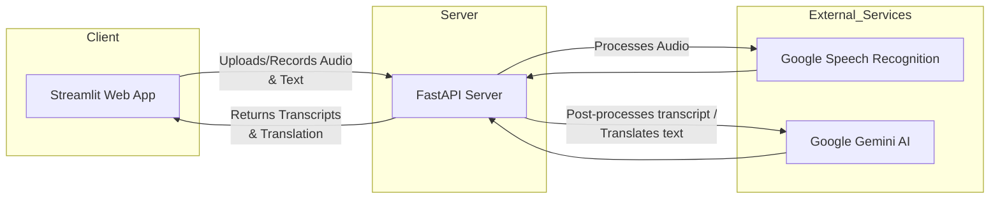

# Healthcare Translation Web App 🏥

A FastAPI and Streamlit–based application that provides real-time medical transcription and translation services.

## Features 🌟

- **Audio Input & Processing**
  - Real-time voice recording via microphone
  - Support for both WAV and MP3 file uploads
  - Chunked audio processing for long recordings
  - Audio duration validation

- **Transcription Capabilities**
  - Speech-to-text conversion with real-time feedback
  - Medical terminology validation
  - Grammar and punctuation correction
  - Support for multiple audio formats

- **Translation Services**
  - Multi-language support (11+ languages)
  - Medical context–aware translations
  - Real-time translation processing
  - Customizable source and target language selection

- **Audio Output**
  - Text-to-speech conversion for translated text
  - Downloadable translated audio
  - Audio playback controls
  - Support for multiple accents

- **User Interface**
  - Mobile-responsive design
  - Dual transcript display (original and corrected)
  - Real-time processing indicators
  - Intuitive language selection

## Architecture 🏗️



## Tech Stack 🛠️

- **Backend Framework**: FastAPI
- **AI Services**: 
  - Google Speech Recognition
  - Google Gemini AI
- **Audio Processing**: pydub
- **Frontend: Streamlit**: Streamlit
- **Environment**: Python 3.8+

## Project Structure 📁

```
python_server/
├── server/
│   ├── routes/
│   │   ├── transcribe.py      # Audio transcription endpoint
│   │   └── translate.py       # Translation endpoint
│   └── server.py              # Main server configuration
├── streamlit_app/
│   ├── components/
│   │   ├── audio_input.py     # Audio input options (record/upload)
│   │   ├── transcription.py   # Calls transcription API
│   │   └── translation.py     # Calls translation API
│   ├── utils/
│   │   └── config.py          # Configuration constants (e.g., API_BASE_URL)
│   └── app.py                 # Main Streamlit app
├── .env                       # Environment variables
└── README.md                  # Project documentation
```

## API Endpoints 🔌

### Transcription

```http
POST /transcribe/
```

- Accepts WAV/MP3 audio files
- Returns original and corrected transcripts
- Handles medical terminology validation

### Translation

```http
POST /translate/
```
- Accepts source language, target language, and text to be translated
- Returns the translated text

## Setup & Installation 💻

1. Clone the repository:
```bash
git clone https://github.com/usman619/healthcare_web_app
cd healthcare_web_app
```

2. Install dependencies:
```bash
pip install -r requirements.txt
```

3. Configure environment variables:
```bash
cp .env.example .env
# Edit .env with your API keys
```

4. Start the server:
```bash
cd server
fastapi dev server.py
```

5. Start the Streamlit app:
```bash
cd ../streamlit_app
streamlit run app.py
```

## Environment Variables 🔐

Required environment variables in `.env`:
- `GEMINI_API_KEY`: Google Gemini AI API key
- `API_BASE_URL`: The base URL of your FastAPI server (including the port)

## API Documentation 📚

Access the interactive API documentation:
- Swagger UI: `http://localhost:8000/docs`
- ReDoc: `http://localhost:8000/redoc`